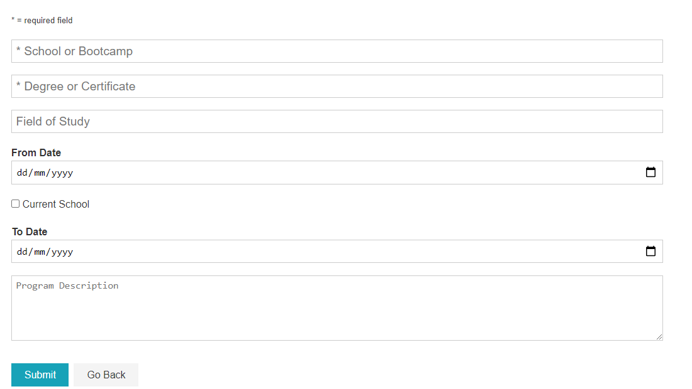
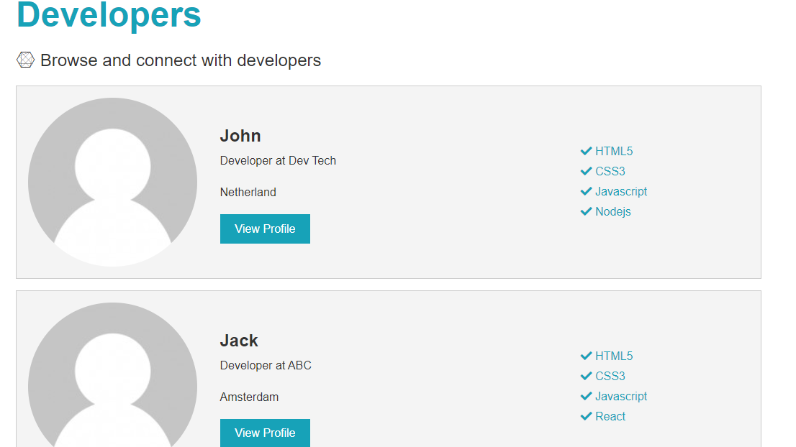
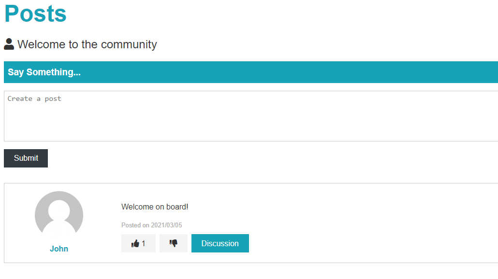
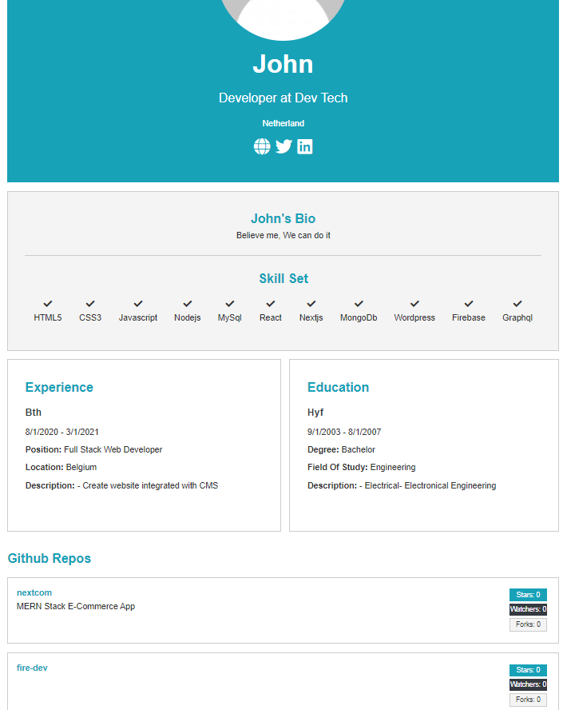
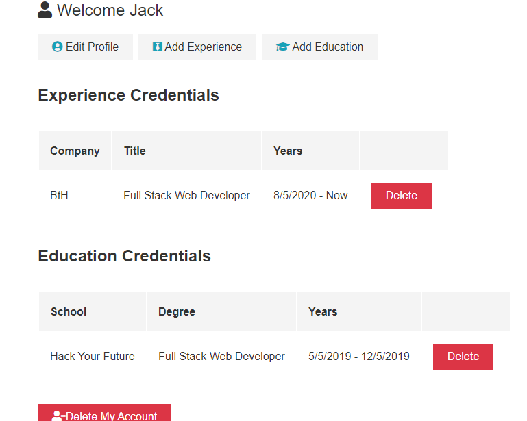

<h1 align="center">
  
  <br>
Developer Connector
</h1>

# Full Stack React MongoDB Express.js Node.js Application

> Best practices to learn React - Redux - Node.js.

## Table of contents

- [Full Stack React MongoDB Express.js Node.js Application](#full-stack-react-mongodb-expressjs-nodejs-application)
  - [Table of contents](#table-of-contents)
    - [Initial Configuration](#initial-configuration)
    - [Developing](#developing)
      - [Running on Development Mode](#running-on-development-mode)
      - [Building](#building)
    - [Deploying / Publishing](#deploying--publishing)
      - [Test production before deploy](#test-production-before-deploy)
      - [Deploy to Heroku](#deploy-to-heroku)
    - [Features](#features)
    - [Covered topics](#covered-topics)
    - [Contributing](#contributing)
    - [Links](#links)
    - [Licensing](#licensing)

### Initial Configuration

1. Database

We are using [MongoDb Atlas](https://www.mongodb.com/cloud/atlas/lp/try2?utm_source=google&utm_campaign=gs_emea_netherlands_search_core_brand_atlas_desktop&utm_term=mongodb%20atlas&utm_medium=cpc_paid_search&utm_ad=e&utm_ad_campaign_id=12212624536&gclid=Cj0KCQiAhP2BBhDdARIsAJEzXlENhhMw2W76Dl-ZoL-toHgfrm7LIQfTOLETUeR6eBdO1KMLwp3d0pQaAuXwEALw_wcB) but you can also choose local database integration. You need `MongoDb Connection String` to connect your cluster.

2. Github Token

This is for listing user's repos. Follow these [instructions](https://docs.github.com/en/github/authenticating-to-github/creating-a-personal-access-token) to access it.

3. Deployment

[Heroku](https://www.heroku.com/) account

- Make sure you have installed `Node.js` and `npm`.

### Developing

```shell
git clone https://github.com/mejustdev/Project-Social-Network.git
cd Project-Social-Network

# Install server dependencies

npm install

# Install client dependencies

cd client
npm install
```

Create `default.json` file in config folder and paste your credentials

> :collision: Do not forget to add this file to the `.gitignore`.

```shell
#  config/default.json

{
  "mongoURI": "",
  "jwtSecret": "",
  "githubToken": ""
}
```

#### Running on Development Mode

```
# Run both Express & React from

npm run dev
```

#### Building

```
cd client
npm run build
```

### Deploying / Publishing

Create your repository on Github. Then use Git Flow and finally push it to the remote

```shell
git add .
git commit -m "initializing project"
git push origin main
```

#### Test production before deploy

After running a build in the client 👆, cd into the root of the project

And run...

Linux/Unix

```bash
NODE_ENV=production node server.js
```

Windows Cmd Prompt or Powershell

```bash
$env:NODE_ENV="production"
node server.js
```

Check in browser on [http://localhost:5000/](http://localhost:5000/)

#### Deploy to Heroku

```bash
git checkout -b production
```

We can use this branch to deploy from, with our config files.

Add the config file

```bash
git add -f config/production.json
```

This will track the file in git on this branch only. **DON'T PUSH THE PRODUCTION BRANCH TO GITHUB**

Commit...

```bash
git commit -m 'ready to deploy'
```

Create your Heroku project

```bash
heroku create
```

And push the local production branch to the remote heroku main branch.

```bash
git push heroku production:main
```

Now Heroku will have the config it needs to build the project.

> **Don't forget to make sure your production database is not whitelisted in MongoDB Atlas, otherwise the database connection will fail and your app will crash.**

After deployment you can delete the production branch if you like.

```bash
git checkout main
git branch -D production
```

Or you can leave it to merge and push updates from another branch.
Make any changes you need on your main branch and merge those into your production branch

```bash
git checkout production
git merge main
```

Once merged you can push to heroku as above and your site will rebuild and be updated

### Features

- Building an **extensive backend API** with Node.js & Express
- Complete User **Authentication** (Login / Signup)
- **Authorization**
- Using Redux for app state management
- Protecting routes/endpoints with JWT (JSON Web Tokens)
- Responsive + Mobile-First Design
- App Deployment with **Heroku**

<p float="left">
  
  
  
  
  
</p>

### Covered topics

- **React Hooks** throughout the entire App
- Next.js API Routes
- User authentication with **JWT and Cookies**
- **Password hashing** with bcrypt
- Modeling database content with **Mongoose Schemas**
- Managing MongoDB database with the **Atlas** Interface
- App Deployment with Deployment Service **Heroku**
- **Protecting private client routes** with React
- **Securing private data** with environment variables
- **Validating Requests** in Node / Express Apps

### Contributing

"If you'd like to contribute, please fork the repository and use a feature
branch. Pull requests are warmly welcome"

### Links

- Project homepage: https://net-werk.herokuapp.com/
- Repository: https://github.com/mejustdev/Project-Social-Network
- Issue tracker: https://github.com/mejustdev/Project-Social-Network/issues
  - In case of sensitive bugs like security vulnerabilities, please contact
    mejustdev@gmail.com directly instead of using issue tracker. I value your effort
    to improve the security and privacy of this project!

### Licensing

"The code in this project is licensed under MIT license."
